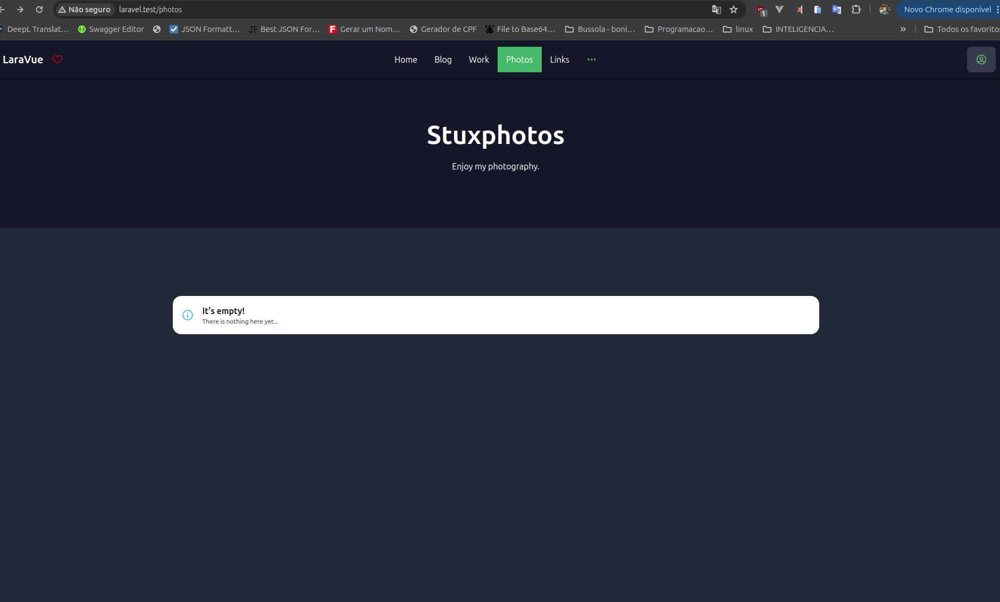

# LaraVue (CMS-ish)

Meow there! This is LaraVue, my self-created CMS-ish for my website [renatolucena.net](https://renatolucena.net)


<p align="center"><a href="#" target="_blank"></a></p>

- [Laravel 9.x](https://laravel.com/).
- [Vue JS 3.x](https://vuejs.org/).
- [Tailwind CSS 2.x](https://tailwindcss.com/).
- [Inertia.js](https://inertiajs.com/).


## How to setup Laravel + Vite in a Docker container
- https://medium.com/@brian978_dev/how-to-setup-laravel-vite-in-a-docker-container-bb3f9de4aad4
Second step to configure Vite is to allow CORS. To do this, you need to head over to vite.config.js and right above the plugins you need to add a server configuration. Default configs change over time but your config will look more or less like this after you make the change (notice the hmr):
```
import { defineConfig } from 'vite';
import laravel from 'laravel-vite-plugin';

export default defineConfig({
    server: {
        hmr: {
            host: 'localhost',
        }
    },
    plugins: [
        laravel({
            input: [
                'resources/css/app.css',
                'resources/js/app.js',
            ],
            refresh: true,
        }),
    ],
});
```


Once last thing you need to do before being able to go in the container and run vite with npm run dev . You need to allow connections in the container for the port that Vite is using. Generally it will be using 5173 but feel free to adjust as needed. The config below needs to go in docker-composer.yml in the section for the php service:

    ports:
      - "5173:5173"


If you want to test out this software for yourself, do checkout our little [documentation](/dist/install.md).


## Sponsors

We would like to extend our thanks to the following sponsors for funding Laravel development. If you are interested in becoming a sponsor, please visit our [GitHub Sponsor page](https://github.com/sponsors/Goldfish-Social).


## Security Vulnerabilities

If you discover a security vulnerability within Laravel, please send an e-mail to Taylor Otwell via [taylor@laravel.com](mailto:taylor@laravel.com). All security vulnerabilities will be promptly addressed.

## License

Gram is open-sourced software licensed under the AGPL license.
